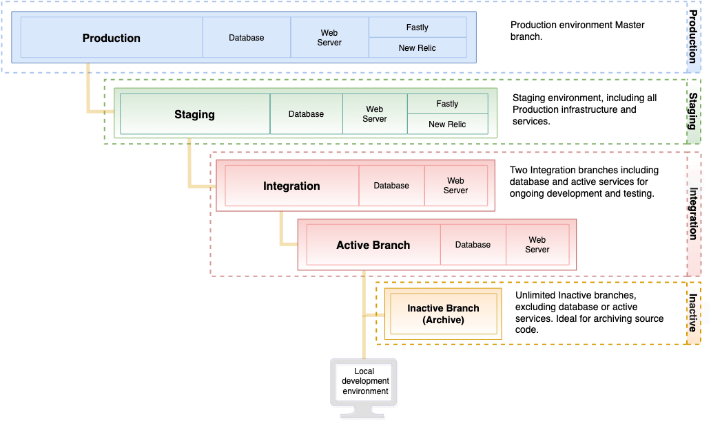

# 入門架構

雲端基礎結構上的Adobe Commerce入門架構最多可支援 **四** 環境，包括 `master` 包含初始專案計畫碼的環境、預備環境，以及最多兩個整合環境。

所有環境都在PaaS (Platform as a service)容器中。 這些容器部署在伺服器格線上的高度受限容器內。 這些環境是唯讀的，會接受從您本機工作區推送的分支所部署的程式碼變更。 每個環境都提供資料庫和Web伺服器。

您可以使用任何您喜歡的開發和分支方法。 取得專案的初始存取許可權時，請建立 `staging` 來自的環境 `master` 環境。 然後，建立 `integration` 環境（透過從分支） `staging`.

## 入門環境架構

下圖顯示入門者環境的階層式關係。

## 生產環境

生產環境提供原始程式碼，可將Adobe Commerce部署至執行公開單一和多網站商店的雲端基礎結構。 生產環境使用來自的程式碼 `master` 分支以設定及啟用網頁伺服器、資料庫、已設定的服務以及您的應用程式程式碼。

因為 `production` 環境是唯讀的，請使用 `integration` 環境以進行程式碼變更，請從在整個架構中部署， `integration` 至 `staging`、以及最後的 `production` 環境。 另請參閱 [部署您的存放區](../deploy/staging-production.md) 和 [網站啟動](../launch/overview.md).

Adobe建議在中完整測試 `staging` 分支，再推送至 `master` 分支，會部署至 `production` 環境。

## 中繼環境

Adobe建議建立名為的分支 `staging` 從 `master`. 此 `staging` Branch會將程式碼部署到中繼環境，以提供預先生產環境來測試程式碼、模組和擴充功能、付款閘道、運送、產品資料等。 此環境提供所有服務的設定以符合生產環境，包括Fastly、New Relic APM和搜尋。

本指南的其他章節提供在安全的預備環境中進行最終程式碼部署和測試生產層級互動的說明。 為進行最佳效能和功能測試，請將資料庫復寫至測試環境。

>[!WARNING]
>
>Adobe建議先在中繼環境中測試每個商家和客戶的互動，然後再部署到生產環境。 另請參閱 [部署您的存放區](../deploy/staging-production.md) 和 [測試部署](../test/staging-and-production.md).

## 整合環境

開發人員使用 `integration` 開發、部署和測試環境：

- Adobe Commerce應用程式程式碼

- 自訂程式碼

- 擴充功能

- 服務

**建議的使用案例：**

整合環境是專為有限的測試和開發所設計。 例如，您可以使用整合環境來完成下列工作：

- 確保對持續整合(CI)流程的變更與雲端相容

- 在關鍵頁面上測試關鍵工作流程，例如首頁、類別、產品詳細資料頁面(PDP)、結帳和管理員

若要在整合環境中取得最佳效能，請遵循下列最佳實務：

- 限制目錄大小

- 限制使用一或兩名同時使用者

- 停用cron工作並根據需要手動執行

您最多可以 **兩個** 使用中的整合環境。 若要建立整合環境，請從以下位置建立分支： `staging` 分支。 當您建立整合環境時，環境名稱會與分支名稱相符。 整合環境包含網頁伺服器和資料庫。 其中並未包含所有服務，例如無法使用Fastly CDN和New Relic。

您可以有不限數量的非使用中分支用於程式碼儲存。 若要存取、檢視和測試非使用中分支，您必須將其啟用

{{enhanced-integration-envs}}

## 生產和測試技術棧疊

生產和測試環境包含下列技術。 您可以透過以下方式修改及設定這些技術： [`.magento.app.yaml`](../application/configure-app-yaml.md) 檔案。

- Fastly用於HTTP快取和CDN
- 與PHP-FPM對話的Nginx網頁伺服器，一個執行個體具有多個背景工作
- Redis伺服器
- Adobe Commerce 2.2至2.4.3-p2的目錄搜尋Elasticsearch
- Adobe Commerce 2.3.7-p3、2.4.3-p2及2.4.4和更新版本的目錄搜尋OpenSearch
- 輸出篩選（輸出防火牆）

### 服務

雲端基礎結構上的Adobe Commerce目前支援下列服務：PHP、MySQL (MariaDB)、Elasticsearch (Adobe Commerce 2.2到2.4.3-p2)、OpenSearch （2.3.7-p3、2.4.3-p2、2.4.4和更新版本）、Redis和 [!DNL RabbitMQ].

每個服務會在個別、安全的容器中執行。 容器在專案中一起管理。 有些是標準服務，例如：

- HTTP路由器（處理傳入要求，以及快取和重新導向）

- PHP應用程式伺服器

- Git

- 安全殼層(SSH)

### 軟體版本

雲端基礎結構上的Adobe Commerce使用Debian GNU/Linux作業系統和NGINX網頁伺服器。 您無法升級此軟體，但可以設定下列版本：

- [PHP](../application/php-settings.md)

- [MySQL](../services/mysql.md)

- [Redis](../services/redis.md)

- [RabbitMQ](../services/rabbitmq.md)

- [Elasticsearch](../services/elasticsearch.md)

- [OpenSearch](../services/opensearch.md)

在測試和生產環境中，您會將Fastly用於CDN和快取。 最新版本的Fastly CDN擴充功能會在專案的初始布建期間安裝。 您可以升級擴充功能以取得最新的錯誤修正和改善專案。 另請參閱 [Magento2的Fastly CDN模組](https://github.com/fastly/fastly-magento2). 此外，您也可存取 [New Relic](../monitor/account-management.md) 進行效能監視。

使用下列檔案來設定您要在實施中使用的軟體版本。

- [&#39;.magento.app.yaml&#39;](../application/configure-app-yaml.md)

- [&#39;routes.yaml&#39;](../routes/routes-yaml.md)

- [&#39;services.yaml&#39;](../services/services-yaml.md)

### 備份與災難回覆

您可以使用建立資料庫和檔案系統的備份 [!DNL Cloud Console] 或CLI。 另請參閱 [備份管理](../storage/snapshots.md).

## 準備開發

以下工作流程總結了分支您的程式碼、開發及部署存放區的程式：

1. 設定您的本機環境

1. 原地複製 `master` 分支至您的本機環境

1. 建立 `staging` 分支來源 `master`

1. 建立用於開發的分支，從 `staging`

1. 將程式碼推送到Git，以便建置和部署至環境進行測試

請參閱下列章節，以取得開發、測試和部署存放區的詳細指示和逐步說明：

- [入門開發與部署工作流程](starter-develop-deploy-workflow.md)

- [Docker開發](../dev-tools/cloud-docker.md) （適用於Commerce的Cloud Docker啟用的本機開發環境）

- [管理分支](../project/console-branches.md)

- [部署您的存放區](../deploy/staging-production.md)

- [網站啟動](../launch/overview.md)
