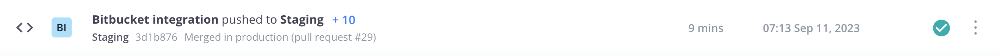

# 位元貯體整合

您可以設定Bitbucket存放庫，以便在推送程式碼變更時自動建立及部署環境。 此整合會在雲端基礎結構帳戶上，將您的Bitbucket存放庫與Adobe Commerce同步。

{{private-repository}}

## 必要條件

- 雲端基礎結構專案上Adobe Commerce的管理員存取權
- [`magento-cloud` CLI](../dev-tools/cloud-cli-overview.md) 本機環境中的工具
- 位元貯體帳戶
- Bitbucket存放庫的管理員存取權
- 位元貯體存放庫的SSH存取金鑰

## 準備您的存放庫

從現有環境複製雲端基礎結構專案上的Adobe Commerce，並將專案分支移轉至新的空位元貯體存放庫，保留相同的分支名稱。 它是 **關鍵** 以保留相同的Git樹狀結構，這樣您就不會遺失雲端基礎結構專案中Adobe Commerce的任何現有環境或分支。

1. 從終端機，在雲端基礎結構專案上登入您的Adobe Commerce。

   ```bash
   magento-cloud login
   ```

1. 列出您的專案並複製專案ID。

   ```bash
   magento-cloud project:list
   ```

1. 將專案複製到您的本機環境。

   ```bash
   magento-cloud project:get <project-ID>
   ```

1. 將您的Bitbucket存放庫新增為遠端。

   ```bash
   git remote add origin git@bitbucket.org:<user-name>/<repo-name>.git
   ```

   遠端連線的預設名稱可能是 `origin` 或 `magento`. 如果 `origin` 存在，您可以選擇不同的名稱，也可以重新命名或刪除現有的參照。 另請參閱 [git-remote檔案](https://git-scm.com/docs/git-remote).

1. 確認您已正確新增Bitbucket遠端。

   ```bash
   git remote -v
   ```

   預期回應：

   ```terminal
   origin git@bitbucket.org:<user-name>/<repo-name>.git (fetch)
   origin git@bitbucket.org:<user-name>/<repo-name>.git (push)
   ```

1. 將專案檔案推送至新的Bitbucket存放庫。 請記得保持所有分支名稱相同。

   ```bash
   git push -u origin master
   ```

   如果您從新的Bitbucket存放庫開始，您可能需要使用 `-f` 選項，因為遠端存放庫不符合您的本機復本。

1. 確認您的Bitbucket存放庫包含所有專案檔案。

## 建立OAuth消費者

Bitbucket整合需要 [OAuth消費者](https://support.atlassian.com/bitbucket-cloud/docs/use-oauth-on-bitbucket-cloud/). 您需要OAuth `key` 和 `secret` 從此取用者，以完成下一區段。

**若要在Bitbucket中建立OAuth消費者**：

1. 登入您的 [位元貯體](https://id.atlassian.com/login) 帳戶。

1. 按一下 **設定** > **存取管理** > **OAuth**.

1. 按一下 **新增消費者** 並依照以下方式設定：

   

   >[!WARNING]
   >
   >有效的 **回呼URL** 非必要，但您必須在此欄位中輸入值，才能成功完成整合。

1. 按一下 **儲存**.

1. 按一下消費者 **名稱** 以顯示您的OAuth `key` 和 `secret`.

1. 複製您的OAuth `key` 和 `secret` 以設定整合。

## 設定整合

1. 從終端機，導覽至您在雲端基礎結構專案上的Adobe Commerce 。

1. 建立名為的暫存檔案 `bitbucket.json` 並新增下列專案，將角括弧中的變數取代為您的值：

   ```json
   {
     "type": "bitbucket",
     "repository": "<bitbucket-user-name/bitbucket-repo-name>",
     "app_credentials": {
       "key": "<oauth-consumer-key>",
       "secret": "<oauth-consumer-secret>"
     },
     "prune_branches": true,
     "fetch_branches": true,
     "build_pull_requests": true,
     "resync_pull_requests": true
   }
   ```

   >[!TIP]
   >
   >請務必使用Bitbucket存放庫的名稱，而非URL。 如果您使用URL，整合將會失敗。

1. 使用將整合新增到您的專案 `magento-cloud` CLI工具

   >[!WARNING]
   >
   >下列命令會覆寫 _全部_ 使用您Bitbucket存放庫中的程式碼，在雲端基礎結構專案上執行Adobe Commerce中的程式碼。 這包括全部分支，包括 `production` 分支。 此動作會立即發生且無法還原。 依據最佳做法的要求，請在雲端基礎結構專案上從Adobe Commerce複製所有分支，並將它們推送至您的Bitbucket存放庫 **早於** 新增Bitbucket整合。

   ```bash
   magento-cloud project:curl -p '<project-ID>' /integrations -i -X POST -d "$(< bitbucket.json)"
   ```

   這會傳回含有標頭的長HTTP回應。 成功的整合會傳回200或201狀態代碼。 若狀態為400或以上，表示發生錯誤。

1. 刪除暫存 `bitbucket.json` 檔案。

1. 驗證專案整合。

   ```bash
   magento-cloud integrations -p <project-ID>
   ```

   ```terminal
   +----------+-----------+--------------------------------------------------------------------------------+
   | ID       | Type      | Summary                                                                        |
   +----------+-----------+--------------------------------------------------------------------------------+
   | <int-id> | bitbucket | Repository: bitbucket_Account/magento-int                                      |
   |          |           | Hook URL:                                                                      |
   |          |           | https://magento-url.cloud/api/projects/<project-id>/integrations/<int-id>/hook |
   +----------+-----------+--------------------------------------------------------------------------------+
   ```

   記下 **連結URL** 以在BitBucket中設定webhook。

### 在BitBucket中新增webhook

為了與您的Cloud Git伺服器通訊事件（例如推播），您的BitBucket存放庫需要有webhook。 若正確遵循Bitbucket整合的設定方法，此頁面上會詳細說明此方法並自動建立Webhook。 請務必驗證webhook以避免建立多個整合。

1. 登入您的 [位元貯體](https://id.atlassian.com/login) 帳戶。

1. 按一下 **存放庫** 並選取您的專案。

1. 按一下 **存放庫設定** > **工作流程** > **Webhooks**.

1. 請先驗證webhook再繼續。

   如果掛接處於活動狀態，請跳過其餘步驟並 [測試整合](#test-the-integration). 掛接的名稱應該類似於 **「雲端基礎結構上的Adobe Commerce &lt;project_id>&quot;** 和類似以下的鉤點URL格式： `https://<zone>.magento.cloud/api/projects/<project_id>/integrations/<id>/hook`

1. 按一下 **新增webhook**.

1. 在 _新增webhook_ 檢視，編輯下列欄位：

   - **標題**：Adobe Commerce整合
   - **URL**：使用來自您的網站的連結URL `magento-cloud` 整合清單
   - **觸發器**：預設為基本 _存放庫推播_

1. 按一下 **儲存**.

### 測試整合

設定Bitbucket整合後，您可以使用驗證整合運作正常 `magento-cloud` CLI：

```bash
magento-cloud integration:validate
```

或者，您也可以推送簡單的變更至位元貯體存放庫以進行測試。

1. 建立測試檔案。

   ```bash
   touch test.md
   ```

1. 認可變更並將其推播至您的Bitbucket存放庫。

   ```bash
   git add . && git commit -m "Testing Bitbucket integration" && git push
   ```

1. 登入 [[!DNL Cloud Console]](../project/overview.md) 並確認您的認可訊息已顯示，且您的專案已部署。

   

## 建立雲端分支

Bitbucket整合無法在雲端基礎結構專案的Adobe Commerce中啟用新環境。 如果您使用Bitbucket建立環境，則必須手動啟動環境。 為了避免這個額外的步驟，最佳作法是使用 `magento-cloud` CLI工具或 [!DNL Cloud Console].

**若要啟用以Bitbucket建立的分支**：

1. 使用 `magento-cloud` CLI以推送分支。

   ```bash
   magento-cloud environment:push from-bitbucket
   ```

   ```terminal
   Pushing from-bitbucket to the new environment from-bitbucket
   Activate from-bitbucket after pushing? [Y/n] y
   Parent environment [master]: integration
   --- (Validation and activation messages)
   ```

1. 確認環境為作用中。

   ```bash
   magento-cloud environment:list
   ```

   ```terminal
   Your environments are:
   +---------------------+----------------+--------+
   | ID                  | Name           | Status |
   +---------------------+----------------+--------+
   | master              | Master         | Active |
   |  integration        | integration    | Active |
   |    from-bitbucket * | from-bitbucket | Active |
   +---------------------+----------------+--------+
   * - Indicates the current environment
   ```

建立環境後，您可以使用一般Git命令將對應分支推送至遠端Bitbucket存放庫。 對您在Bitbucket中的分支進行的後續變更會自動建置和部署環境。

## 移除整合

您可以安全地從專案移除Bitbucket整合，而不會影響您的程式碼。

**移除Bitbucket整合的方式**：

1. 從終端機，在雲端基礎結構專案上登入您的Adobe Commerce。

1. 列出您的整合。 您需要Bitbucket整合ID才能完成下一步。

   ```bash
   magento-cloud integration:list
   ```

1. 刪除整合。

   ```bash
   magento-cloud integration:delete <int-ID>
   ```

此外，您也可以登入您的Bitbucket帳戶並撤銷帳戶上的OAuth授權，以移除Bitbucket整合 _設定_ 頁面。

## Bitbucket伺服器整合

若要使用Bitbucket伺服器整合，您需要下列專案：

- [位元貯體存取權杖](https://confluence.atlassian.com/bitbucketserver/http-access-tokens-939515499.html) — 產生授與專案的權杖 `read` 存取權和存放庫 `admin` 存取
- [Bitbucket伺服器URL](https://confluence.atlassian.com/bitbucketserver/specify-the-bitbucket-base-url-776640392.html) — 新增Bitbucket執行個體的基底URL

雖然您可以使用Cloud CLI來進行Bitbucket伺服器整合步驟，但完整的命令看起來類似以下內容：

```bash
magento-cloud integration:add --type=bitbucket_server --base-url=<bitbucket-url> --username=<username> --token=<bitbucket-access-token> --project=<project-ID>
```

使用help指令瞭解更多使用需求和選項： `magento-cloud integration:add --help`
