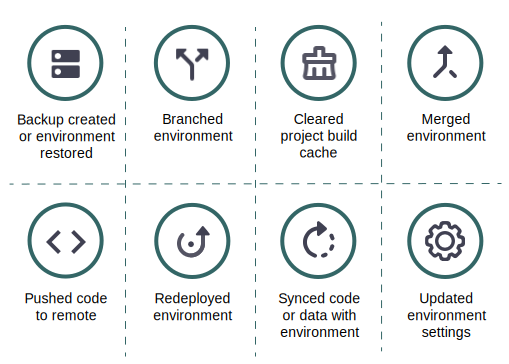

# 活動資料流

每個環境的主要檢視會顯示 **活動** 類似Git記錄檔的歷史事件清單。 活動清單是作用中環境最近事件的資料流。 以下是顯示在「活動」資料流中的活動型別及其圖示清單：

{width="500" align="center"}

## 檢視記錄

在活動清單中，按一下活動的狀態圖示以檢視記錄。 或者，按一下 {width="32"} (_更多_)功能表，以存取管理活動的更多選項。 以下顯示建立備份的簡短記錄。 您可以 [使用Cloud CLI](#activity-stream-with-cloud-cli) 以檢視相同的記錄。


## 管理活動

部分活動位於 _執行中_ 或 _擱置中_ 狀態。 您可以在執行中的活動上執行動作，例如取消執行中的部署。 下列標籤顯示取消活動的兩種方法： [!DNL Cloud Console] 或Cloud CLI。

>[!BEGINTABS]

>[!TAB 主控台]

**若要取消中的活動，請執行下列步驟：[!DNL Cloud Console]**：

您可以存取「 」，在執行中的活動上採取行動。 {width="32"} (_更多_)功能表並選取動作，例如 `Cancel` 或 `View log`. 在此範例中，選取 **取消** 停止執行中活動的選項。

並非所有活動都有取消選項。 例如，取消應用程式部署的選項只會在 _版本編號_ 階段。 當應用程式移入 _部署_ 階段，您無法再取消活動。 另請參閱 [部署流程](../deploy/process.md) 關於不同的階段。

{width="450" align="center"}

如果您有終端機執行部署活動，請在 [!DNL Cloud Console] 會導致終端機中的取消：

{width="300"}

>[!TAB CLI]

**若要取消雲端CLI中的活動**：

1. 識別執行中的活動並選取活動ID。

   ```bash
   magento-cloud activity:list --state=in_progress
   ```

1. 使用活動ID取消活動：

   ```bash
   magento-cloud activity:cancel wvl5wm7s5vkhy
   ```

>[!ENDTABS]

## 篩選活動資料流

當您尋找特定專案（例如備份或合併事件）時，篩選活動清單的功能相當實用。

**若要在中篩選活動清單[!DNL Cloud Console]**：

1. 選取環境並選擇活動 **[!UICONTROL All]** 檢視以包含完整的事件歷史記錄。

1. 按一下 {width="32"} 並選取 **[!UICONTROL Filter by]** 選項：

   

1. 選擇活動 **[!UICONTROL Recent]** 檢視和重設清單。

## 使用Cloud CLI檢視資料流

此 `magento-cloud` CLI提供的功能大多與 [!DNL Cloud Console]. 此 `activity` 命令可以：

- `list` 環境的活動串流
- `get` 有關特定活動的詳細資訊
- 顯示 `log` 特定活動的資訊
- `cancel` 活動

**使用Cloud CLI檢視活動資料流的方式**：

1. 列出目前環境的活動。

   ```bash
   magento-cloud activity:list
   ```

1. 每個活動都有唯一的ID。 從先前的清單中選取ID，並檢視該活動的詳細資訊。

   ```bash
   magento-cloud activity:get wvl5wm7s5vkhy
   ```

1. 檢視該活動的完整記錄。

   ```bash
   magento-cloud activity:log wvl5wm7s5vkhy
   ```

   範例回應：

   ```bash
   Activity ID: wvl5wm7s5vkhy
   Type: environment.backup
   Description: User created a backup of Master
   Created: 2023-09-08T14:03:33+00:00
   State: complete
   Log:
   Creating backup of master
   Created backup eg5pu63egt2dcojkljalzjdopa
   ```
