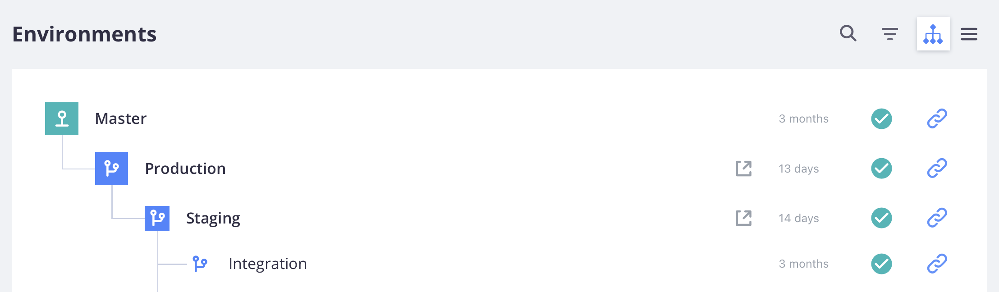

# 雲端基礎結構專案

雲端基礎結構專案上的Adobe Commerce包含Git分支中的所有程式碼、關聯的環境，以及用於部署 [!DNL Commerce] 應用程式。 環境包含可支援 [!DNL Commerce] 應用程式，包括資料庫、Web伺服器和快取伺服器。

Adobe提供 [!DNL Cloud Console] 和開發人員工具來完整管理專案的所有層面。 您做為帳戶擁有者，擁有所有環境的完整存取權。

## [!DNL Cloud Console]

此 [!DNL Cloud Console] 提供互動式方法，以方便使用的格式建立、管理和部署Commerce程式碼。 [登入 [!DNL Cloud Console]](https://console.adobecommerce.com) 以檢視您的專案清單。 您只能看見自己有權以管理員身分或針對特定環境型別存取的專案。 如果您是Adobe解決方案合作夥伴，可能會看到您支援之客戶的多個專案。

>[!TIP]
>
>如果您沒有看到任何專案，則必須聯絡 [帳戶擁有者或專案管理員](../project/user-access.md) 與專案相關聯，並請求存取權。 若為首次使用者，請參閱 [入門主題](../../get-started/onboarding.md#cloud-console) 在 _開始使用_ 指南。

此 _所有專案_ 檢視會列出您有權存取的所有專案。 您可以按一下 **[!UICONTROL Show filters]** 並依型別、地區或計畫篩選您的專案清單。


### 專案概述

從選取專案 _所有專案_ 清單會開啟專案概述。 專案概述一律會顯示專案導覽列，其中包括環境選擇器和設定按鈕：


專案概觀（只要您未選取環境）會在預覽區域顯示專案詳細資訊的摘要：

- 專案名稱
- 地區，專案ID
- 計畫、分配的儲存空間、環境、使用者
- 店面URL搭配 **[!UICONTROL Set a custom domain]** 按鈕

在主要專案概述中：

- 環境檢視顯示清單或樹狀檢視 {width="32"} (active) and {width="32"} （非使用中）環境。
- [活動資料流](activity-stream.md) 顯示專案的執行、擱置和最近活動。
<!-- - Apps & Services—Shows a topology of service containers -->

的 **入門者** 專案時，會有一個分支的層次結構，從 `master` （生產）。 您建立的任何分支都會顯示為來自 `master` 分支。 Adobe建議建立 `staging` 分支，然後建立 `integration` 分支以進行開發。 另請參閱 [入門架構](../architecture/starter-architecture.md).

的 **Pro**，會有從開頭的分支階層 `production` 至 `staging` 至 `integration`. 此 {width="32"} 圖示表示分支部署到專用環境。 您建立的任何分支都會顯示為 `integration` 分支。 另請參閱 [Pro架構](../architecture/pro-architecture.md).



### 環境概觀

從專案導覽列選取環境時，會變更概述和導覽列，以專注於選取的環境。 導覽列包含分支控制項（分支、合併和同步）和設定按鈕：


環境概觀在預覽區域顯示環境詳細資訊的摘要：

- 環境名稱，型別
- 地區，專案ID
- 上次活動的日期和時間，包括備份
- HTTP存取和搜尋引擎狀態
- 指派給環境的電腦名稱
- 環境狀態（作用中或非作用中）
- 店面URL搭配 **[!UICONTROL Set a custom domain]** 按鈕

而在主要環境概觀中：

- [活動資料流](activity-stream.md) 組成主要環境概觀，並顯示所選環境的執行中、擱置中及最近活動。
<!-- - Services tab shows and Apps & Services menu, including overview and configuration tabs for each service. -->
- [「備份」標籤](../storage/snapshots.md#create-a-manual-backup) 提供已儲存備份的清單、備份動作的歷程記錄，以及「備份」按鈕。

### 存取店面

每個使用中環境都有店面。 從頂端導覽列中選取環境，然後按一下環境概觀中的URL。 此外， **[!UICONTROL URLs]** 清單位於活動清單上方的右側。

Web Access URL可能包含下列專案：

```terminal
https://<branch>-<unique-ID>-<project-ID>.<region>.magentosite.cloud/
```

- **唯一識別碼** = 7個隨機英數字元
- **專案ID** = 13個字元的專案識別碼
- **地區** =AWS或Azure區域名稱，請參閱 [地區IP位址](regional-ip-addresses.md)

Pro生產和中繼環境包含三個節點，您可以使用以下連結加以存取：

- 負載平衡器URL：

   - `http[s]://<your-domain>.c.<project-ID>.ent.magento.cloud`
   - `http[s]://<your-staging-domain>.c.<project-ID>.ent.magento.cloud`

- 直接存取下列三個備援伺服器之一：

   - `http[s]://<your-domain>.{1|2|3}.<project-ID>.ent.magento.cloud`
   - `http[s]://<your-staging-domain>.{1|2|3}.<project-ID>.ent.magento.cloud`

  生產URL由內容傳遞網路(CDN)使用。

## 設定

開啟 _設定_ 面板，按一下 {width="36"} （設定）圖示位於專案導覽的右側。

### 專案設定

**[!UICONTROL Project Settings]** 展開專案層級控制項功能表以管理使用者、變數等：

| 選項 | 說明 |
|--------------|-------------------------------------------------------------------------------------------------------------------------------|
| 一般 | 管理用於排程備份或維護的時區。 |
| 存取 | 管理 [使用者存取](user-access.md) 至專案和環境型別。 |
| 憑證 | 檢視與專案相關聯的SSL憑證清單。 |
| 部署金鑰 | 新增並檢視專案程式碼存放庫的公開金鑰。 |
| 網域 | 將網域名稱新增到專案。 另請參閱 [管理網域](../cdn/fastly-custom-cache-configuration.md#manage-domains). |
| 整合 | 新增和管理 [整合](../integrations/overview.md)，例如健康情況通知和webhook。 |
| 變數 | 新增 [專案層級變數](../environment/variable-levels.md) 這些環境可在所有環境的建置和執行階段使用。 |

{style="table-layout:auto"}

### 環境設定

按一下 **[!UICONTROL Environments]** 並從控制項清單中選取特定環境，以管理網站設定、環境變數等：

| 選項 | 說明 |
| --------- | -------------------------------------------------------------------------------------------------------------------------------- |
| 一般 | 設定顯示名稱、環境型別和父環境。<br>切換不同的環境設定： |
|           | **啟用外寄電子郵件**：傳送 [傳出電子郵件](outgoing-emails.md) 使用SMTP通訊協定的環境中。 |
|           | **在搜尋引擎隱藏**：從網站封鎖搜尋引擎索引器和編目程式。 |
|           | **HTTP存取控制**：啟用的安全性設定 [!DNL Cloud Console] 使用登入和IP位址存取控制。 |
|           | 狀態為 `active` 或 `inactive`. 您的大部分工作都在使用中環境中。 您可以停用或刪除環境。 |
| 變數 | 檢視、建立和管理 [環境層級變數](../environment/variable-levels.md) 可在執行階段使用。 |
| 網域 | 檢視清單 [已設定的路由](../routes/routes-yaml.md). |

{style="table-layout:auto"}

>[!WARNING]
>
>**不要** 使用HTTP存取控制方法來保護專業測試環境和生產環境。 這會中斷Fastly快取。 請改用 [封鎖](../cdn/fastly-vcl-blocking.md) Adobe Commerce的Fastly CDN中可用的功能。

## Fastly和New Relic認證

您的專案包括 [Fastly](../cdn/fastly.md) 和 [New Relic](../monitor/new-relic-service.md). 專案詳細資料會顯示您專案計畫的資訊，以及這些整合的重要授權和權杖。 只有授權擁有者才具有認證和服務的初始存取權。 視需要將這些憑證提供給技術和開發人員資源。

- [Fastly](https://www.fastly.com/) 在雲端基礎結構專案上為您的Adobe Commerce提供內容傳送(CDN)、影像最佳化和安全性服務（DDoS和WAF）。 另請參閱 [取得Fastly認證](../cdn/fastly-configuration.md#get-fastly-credentials).

- [New Relic](../monitor/new-relic-service.md) 為中繼和生產環境提供應用程式量度和效能資訊。

使用 [雲端CLI](../dev-tools/cloud-cli-overview.md) 若要檢閱整合Token、ID等：

```bash
magento-cloud subscription:info services
```
