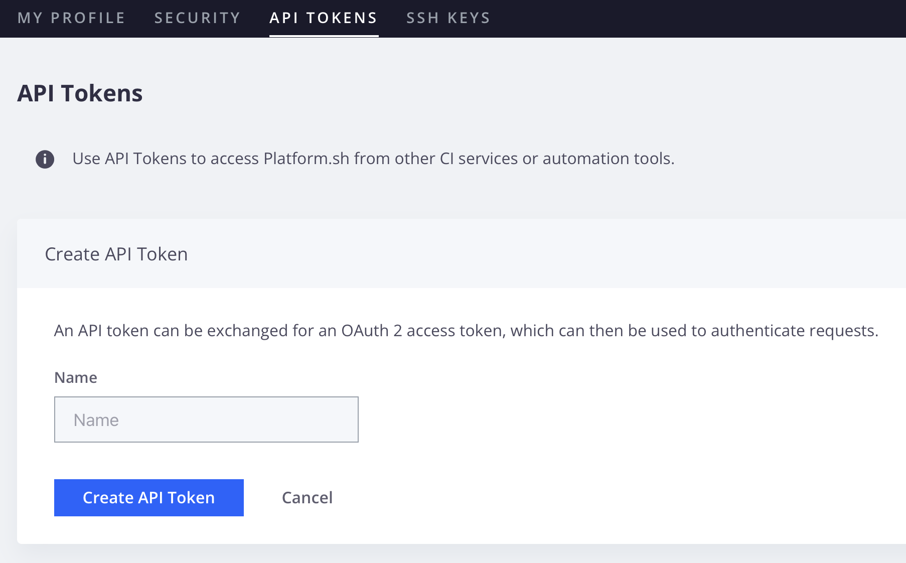

# 管理使用者存取權

雲端基礎結構上的Adobe Commerce專案使用角色型存取。 專案層級有兩個可用的角色：

- **專案管理員** — 寫入所有專案環境的存取權，並可管理使用者、推送代碼和更新專案設定。 （先前稱為&#x200B;**超級管理員**）
- **專案檢視器** — 所有專案環境的僅限檢視存取權。

專案檢視器無法在任何環境中執行任務；不過，您可以授予專案檢視器特定環境型別的寫入許可權。

環境層級的存取取決於環境型別：生產、測試和開發。 授與使用者&#x200B;_檢視器_&#x200B;對&#x200B;_開發_&#x200B;環境的許可權，表示他們可以檢視專案中的&#x200B;**所有**&#x200B;開發環境。 下表釐清授予各個許可權層級的功能：

| 許可權層級 | 存取 | SSH存取 |
| ------------------ | ----------- | :----------: |
| **管理員** | 執行管理員工作，例如變更設定、推播程式碼、執行工作及分支管理，包括合併父環境 | 是 |
| **參與者** | 推送程式碼並分支環境；無法變更設定或執行動作 | 是 |
| **檢視器** | 對環境型別的僅限檢視存取權 | 否 |
| **無存取權** | 無法存取環境型別 | 否 |

{style="table-layout:auto"}

您可以使用`magento-cloud` CLI或[!DNL Cloud Console]新增使用者並指派角色。

>[!BEGINSHADEBOX]

**必要條件：**

- 已註冊Adobe ID的使用者。 使用者必須[註冊Adobe帳戶](https://account.adobe.com)，然後[初始化其雲端帳戶](https://console.adobecommerce.com)，您才能將其新增至雲端專案。
- 已指派&#x200B;**管理員**&#x200B;角色的使用者無法管理具有`magento-cloud` CLI的使用者。 只有被授與&#x200B;**帳戶擁有者**&#x200B;角色的使用者才能管理使用者。

>[!ENDSHADEBOX]

## 使用CLI管理使用者

使用`magento-cloud` CLI管理使用者並與自動化系統整合：

- `magento-cloud user:add` — 將使用者新增至專案
- `magento-cloud user:delete` — 刪除使用者
- `magento-cloud user:list [users]` — 列出專案使用者
- `magento-cloud user:role` — 檢視或變更使用者角色
- `magento-cloud user:update` — 更新專案上的使用者角色

下列範例使用`magento-cloud` CLI來新增使用者、設定角色、修改專案指派及指派使用者角色。

**若要新增使用者並指派角色**：

1. 使用`magento-cloud` CLI來新增使用者。

   ```bash
   magento-cloud user:add
   ```

   >[!IMPORTANT]
   >
   >使用者必須有Adobe ID；請參閱[必要條件](#add-users-and-manage-access)。

1. 按照提示操作：指定使用者電子郵件地址、設定專案和環境型別角色，並新增使用者。

   > 範例提示

   ```
   Enter the user's email address: alice@example.com
   
   Email address: alice@example.com
   
   The user's project role can be admin (a) or viewer (v).
   
   Project role (default: viewer) [a/v]: viewer
   
   The user's environment type role(s) can be admin (a), viewer (v), contributor (c) or none (n).
   
   Role on type development (default: none) [a/v/c/n]: none
   Role on type production (default: none) [a/v/c/n]: admin
   Role on type staging (default: none) [a/v/c/n]: admin
   
   Adding the user alice@example.com to (project_id):
   Project role: viewer
     Role on type production: admin
     Role on type staging: admin
   
   Are you sure you want to add this user? [Y/n] y
   Adding the user to the project
   ```

   新增使用者後，Adobe會傳送電子郵件至指定地址，附上存取雲端基礎結構專案上Adobe Commerce的說明。

### 檢視使用者的專案角色

```bash
magento-cloud user:get alice@example.com
```

>範例回應：

```
Current role(s) of User (alice@example.com) on Production (project_id):
  Project role: admin
```

### 新增使用者至多個環境

若要在`Production`環境中將使用者新增為`viewer`，並在`Integration`環境中將使用者新增為`contributor`：

```bash
magento-cloud user:add alice@example.com -r production:v -r integration:c
```

### 更新使用者環境許可權

若要在`Production`環境上將使用者環境許可權更新為`admin`：

```bash
magento-cloud user:update alice@example.com -r production:a
```

## 從[!DNL Cloud Console]管理使用者

您可以使用[[!DNL Cloud Console]](../../get-started/cloud-console.md)來新增許可權，並使用&#x200B;_編輯_&#x200B;功能來修改現有使用者的許可權。

>[!IMPORTANT]
>
>使用者必須有Adobe ID；請參閱[必要條件](#add-users-and-manage-access)。

### 將使用者新增至專案

1. 登入[[!DNL Cloud Console]](https://console.adobecommerce.com/)。

1. 從&#x200B;_所有專案_&#x200B;清單中選取專案。

1. 在「專案」控制面板上，按一下右上方的設定圖示。

1. 在&#x200B;_專案設定_&#x200B;下，按一下&#x200B;**[!UICONTROL Access]**。

1. 在&#x200B;_存取_&#x200B;檢視中，按一下&#x200B;**[!UICONTROL Add]**。

1. 完成&#x200B;_[!UICONTROL Add User]_表單：

   - 輸入使用者電子郵件地址。

   - **[!UICONTROL Project admin]** — 授予所有設定和環境型別的管理員許可權。

   - **[!UICONTROL Environment types and permissions]** — 將存取權和特定許可權層級授與特定環境型別。 _無存取權_、_管理員_ （變更設定、執行動作、合併程式碼）、_參與者_ （推播程式碼）或&#x200B;_檢視器_ （僅供檢視）。

   >[!TIP]
   >
   >只有&#x200B;**專案管理員**&#x200B;可以在任何環境中管理使用者。 若要授與使用者對&#x200B;**存取權**&#x200B;標籤的存取權，其他&#x200B;**專案管理員**&#x200B;或&#x200B;**帳戶擁有者**&#x200B;必須將該使用者指派為&#x200B;**專案管理員**&#x200B;角色。

1. 按一下&#x200B;**[!UICONTROL Add User]**。

   >[!IMPORTANT]
   >
   >新增使用者不會自動觸發部署。

1. 新增使用者後，重新部署所有環境以套用變更。 新增使用者不會自動觸發部署。 重新部署是確保使用者可以使用SSH存取環境或執行管理員工作的重要步驟。

新增使用者後，Adobe會傳送電子郵件至指定地址，附上存取雲端基礎結構專案上Adobe Commerce的說明。

## 使用者驗證需求

為了增加安全性，Adobe提供專案層級的多重驗證(MFA)強制要求，以要求對雲端基礎結構專案原始碼和環境上的Adobe Commerce進行SSH存取的雙重驗證(TFA)。 請參閱[啟用SSH的MFA](multi-factor-authentication.md)。

在雲端基礎結構專案的Adobe Commerce上啟用MFA強制執行時，該專案中擁有環境SSH存取權的所有使用者，必須在雲端基礎結構帳戶上的Adobe Commerce上啟用TFA。 對於自動化程式，您可以從命令列建立電腦使用者和API權杖以進行驗證。

將使用者新增至雲端專案後，請要求使用者檢閱其帳戶安全性設定，並視需要新增下列安全性設定：

- **啟用TFA** — 設定雙因素驗證，以符合安全性與法規遵循標準。 使用[MFA強制執行](multi-factor-authentication.md)設定的專案需要使用SSH存取專案的帳戶上的TFA。

- **啟用SSH金鑰** — 需要在雲端基礎結構原始程式碼存放庫上存取Adobe Commerce的使用者，必須在他們的帳戶上啟用SSH金鑰。 請參閱[安全連線](../development/secure-connections.md)。

- **建立API權杖** — 使用者必須產生用於環境SSH存取的API權杖。 您需要Token才能啟用自動化程式的驗證工作流程。

  在啟用MFA強制的專案上，您必須使用API權杖來驗證來自自動化帳戶的SSH存取請求。 代號可讓自動化程式略過需要TFA的驗證工作流程。

### 為雲端帳戶啟用TFA

雲端基礎結構上的Adobe Commerce支援使用下列任何應用程式的TFA：

- [Google Authenticator (Android/iPhone)](https://support.google.com/accounts/answer/1066447?hl=en)
- [授權(Android/iPhone)](https://authy.com/features/)
- [FreeOTP (Android)](https://play.google.com/store/apps/details?id=org.fedorahosted.freeotp)
- [GAuth Authenticator （Firefox OS、桌上型電腦、其他）](https://github.com/gbraad-apps/gauth)

在[!DNL Cloud Console]的&#x200B;_帳戶設定_&#x200B;頁面上提供安裝驗證器應用程式及啟用TFA的說明。

**若要在您的使用者帳戶上啟用TFA**：

1. 登入[您的帳戶](https://console.adobecommerce.com)。

1. 在右上角帳戶功能表中，按一下&#x200B;**[!UICONTROL My Profile]**。

1. 在&#x200B;_安全性_&#x200B;標籤上，按一下&#x200B;**[!UICONTROL Set up application]**。

1. 如果您的行動裝置上沒有核准的驗證器應用程式，請使用連結的指示來安裝。

1. 將雲端基礎結構帳戶上的Adobe Commerce新增到驗證器應用程式。

   - 在您的行動裝置上，開啟驗證器應用程式。 然後，將安裝程式碼新增至應用程式。

   - 在[!UICONTROL **[!UICONTROL TFA set up - Application]**]頁面的&#x200B;**[!UICONTROL Application verification code]**&#x200B;欄位中，輸入行動裝置的TFA代碼。

   - 按一下&#x200B;**[!UICONTROL Verify and save]**。

     如果代碼有效，Adobe會傳送通知至帳戶電子郵件地址，確認帳戶現在具有TFA。

1. 選填。 啟用&#x200B;_信任的瀏覽器_&#x200B;設定，將驗證碼在瀏覽器中快取30天。

   此設定可減少專案登入期間的驗證難題數量。

1. 按一下&#x200B;**儲存**&#x200B;或&#x200B;**略過**。

1. 儲存復原始碼。

   - 在&#x200B;_TFA設定 — 復原_&#x200B;程式碼頁面上，複製並儲存復原程式碼，以便在無法存取行動裝置或驗證應用程式時，可以登入雲端基礎結構專案上的Adobe Commerce。

   - 將復原始碼複製到其他位置，或寫下代碼，以防您失去對裝置或驗證應用程式的存取權。

   - 按一下[儲存]****&#x200B;將程式碼儲存至您的帳戶，以便您可從帳戶安全性設定檢視和管理程式碼。

     >[!WARNING]
     >
     >如果您無法存取具有TFA的帳戶，且沒有復原始碼清單，則必須連絡專案管理員，或[提交Adobe Commerce支援票證](https://experienceleague.adobe.com/docs/commerce-knowledge-base/kb/help-center-guide/magento-help-center-user-guide.html#submit-ticket)以重設TFA應用程式。

1. 完成TFA設定後，按一下[儲存] **以更新您的帳戶。**

1. 使用TFA驗證您目前的工作階段。

   - 登出您的帳戶。
   - 使用您的使用者名稱和密碼登入。
   - 出現提示時，從行動裝置上的驗證器應用程式輸入`accounts.magento.cloud`專案的TFA代碼。

### 管理TFA設定和復原程式碼

您可以從&#x200B;_我的設定檔_&#x200B;頁面上的&#x200B;_安全性_&#x200B;區段，管理雲端基礎結構帳戶上Adobe Commerce的TFA設定。

1. 登入[您的帳戶](https://console.adobecommerce.com)。

1. 在右上角帳戶功能表中，按一下&#x200B;**[!UICONTROL My Profile]**。

1. 在&#x200B;_我的設定檔_&#x200B;頁面上，按一下「**[!UICONTROL Security]**」標籤。

1. 使用可用連結更新雲端基礎結構帳戶上Adobe Commerce的TFA設定：

   - 停用TFA
   - 重設驗證器應用程式
   - 新增或移除信任的瀏覽器
   - 檢視或重新整理您帳戶上的TFA復原始碼

### 建立API權杖

API權杖可以交換為OAuth 2存取權杖，然後使用它來驗證請求。

在已啟用MFA強制的專案中，您必須擁有API權杖，才能為電腦使用者和自動化程式啟用SSH存取。

>[!IMPORTANT]
>
>您帳戶的Protect API Token值。 請勿在程式碼範例、熒幕擷取或不安全的使用者端 — 伺服器通訊中公開值。 此外，請勿公開儲存在公共存放庫的原始程式碼中的值。

**若要建立API權杖**：

1. 登入[您的帳戶](https://console.adobecommerce.com)。

1. 在右上角帳戶功能表中，按一下&#x200B;**[!UICONTROL My Profile]**。

1. 在&#x200B;_我的設定檔_&#x200B;頁面上，按一下「**[!UICONTROL API tokens]**」標籤。

1. 按一下&#x200B;**[!UICONTROL Create API token]**&#x200B;並輸入名稱，例如，指定符合電腦使用者或使用API權杖的自動化程式的名稱。

   

1. 按一下&#x200B;**[!UICONTROL Create API token]**。
