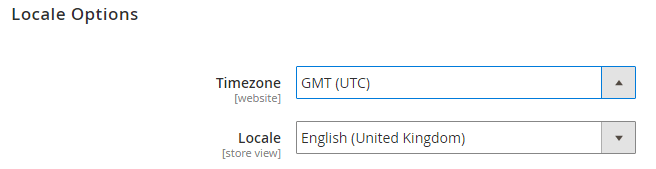

# 管理系統特定設定的範例

此範例說明如何使用組態管理，讓所有環境的存放區設定保持一致。

此範例使用下列在中定義的程式 [商店設定](store-settings.md)：

1. 在整合環境存放區管理員中輸入您的設定。
1. 建立 `config.php` 檔案並傳輸至您的本機工作站。
1. 推播 `config.php` 至遠端整合環境。
1. 確認您的設定在「管理員」中不可編輯。
1. 進行任何必要的修改：

   * 變更整合環境中的組態設定。
   * 若要新增組態，請執行命令以建立 `config.php` 再來一次。 新的設定會附加至檔案。
   * 若要移除或編輯現有組態，請手動編輯檔案。
   * 提交和推播。

例如，您可能想要設定下列設定：

* 停用 [地區設定](https://glossary.magento.com/locale) 以及整合環境中的靜態檔案最佳化設定
* 在中繼和生產環境中啟用靜態檔案最佳化
* 在測試和生產環境中為Fastly設定每個專案的特定認證

_靜態檔案最佳化_ 是指合併和縮制JavaScript和階層式樣式表，以及縮制HTML範本。 另請參閱 [靜態內容部署策略](../deploy/static-content.md).

## 必要條件

若要完成這些組態管理工作，您需要下列專案：

* 專案讀者角色，具有 [環境「管理員」](../project/user-access.md) 許可權
* 整合、測試和生產環境的管理員URL和認證

## 設定Commerce管理員

在整合環境中，您可以登入「管理員」來修改商店、網站、模組或擴充功能的系統組態設定、靜態檔案最佳化，以及與靜態內容部署相關的系統值。 另請參閱 [設定資料](store-settings.md#scd-performance).

**若要變更地區設定和靜態檔案最佳化設定**：

1. 登入整合環境管理員。 您可以透過以下方式存取此URL： [[!DNL Cloud Console]](../project/overview.md).
1. 瀏覽至 **商店** >設定> **設定** >一般> **一般**.
1. 在頁面導覽中，展開 **地區設定選項**.
1. 從 **地區設定** 清單，變更地區設定。 您可稍後再變更回來。

   

1. 按一下 **儲存設定**.
1. 如果出現提示， [排清快取](https://docs.magento.com/user-guide/system/cache-management.html).
1. 登出Admin。

## 匯出值並將config.php傳輸至您的本機系統

此步驟會建立並移轉 `config.php` 使用您在本機電腦上執行的命令，在整合環境中設定檔案。

此程式對應至 [建議的程式](store-settings.md). 建立之後 `config.php`，將其傳輸至您的本機系統，以便您將其新增至Git。

**若要建立與轉移`config.php`**：

1. 在本機工作站上，變更至專案目錄。

1. 變更至整合環境。

   ```bash
   magento-cloud environment:checkout integration
   ```

1. 建立遠端資料庫的本機傾印。

   ```bash
   magento-cloud db:dump
   ```

下列片段 `config.php` 顯示將預設地區設定變更為 `en_GB` 以及變更靜態檔案最佳化設定：

```php?start_inline=1
'general' => [
     'locale' => [
         'code' => 'en_GB',
         'timezone' => 'UTC',
     ],

     ... more ...

 'dev' => [
     'template' => [
         'allow_symlink' => '0',
         'minify_html' => '0',
     ],
     'js' => [
         'merge_files' => '0',
         'enable_js_bundling' => '0',
         'minify_files' => '0',
     ],
     'css' => [
         'merge_css_files' => '0',
         'minify_files' => '0',
     ],

     ... more ...
```

## 將config.php推送並部署到環境

現在您已建立 `config.php` 並將其傳輸到您的本機系統、將其提交到Git並將其推送到您的環境。 此程式對應至 [建議的程式](store-settings.md).

下列命令會新增、認可並推送至 `master` 分支：

```bash
git add app/etc/config.php && git commit -m "Add system-specific configuration" && git push origin master
```

完成將程式碼部署到中繼和生產環境。 首先，您推送至 `staging` 和 `master` 分支。 如需部署命令的詳細資訊，請參閱 [部署您的存放區](../deploy/staging-production.md).

等待在所有環境中完成部署。

## 驗證您的設定變更

在您推播之後 `config.php` 對於您的環境，您變更的任何值在Admin中都應是唯讀的。 在此範例中，修改過的預設地區設定和靜態檔案最佳化設定不應該在Admin中編輯。 這些組態設定是在 `config.php`.

若要驗證您的設定變更，請執行下列動作：

1. 在其中一個環境中登出Admin。
1. 重新登入管理員。
1. 按一下 **商店** >設定> **設定** >一般> **一般**.
1. 在右窗格中，展開 **地區設定選項**.

   請注意，數個欄位無法編輯，如下列範例所示。 這些組態設定是由 `config.php`.

   

1. 登出Admin。

## 變更和更新系統特定的組態設定

如果您需要修改其中的任何設定，請修改 `config.php` 使用文字編輯器手動建立檔案。 完成編輯或移除後，您可以依照先前步驟提交並將其推送到遠端環境。

若要新增設定，請修改您的整合環境，然後再次執行命令以產生檔案。 任何新設定都會附加至檔案中的程式碼。 按照上述步驟將其推送到Git。

在此範例中，請修改靜態檔案最佳化設定，並為JavaScript新增設定。

### 在整合中新增設定

若要在整合環境管理員中新增設定值。 此範例合併JavaScript檔案。

1. 登出整合「管理員」。
1. 重新登入整合管理員。
1. 按一下 **商店** >設定> **設定** > **進階** > **開發人員**.
1. 在右窗格中，展開 **JavaScript設定**.
1. 從 **合併JavaScript檔案** 清單，按一下 **是**.
1. 按一下 **儲存設定**.
1. 如果出現提示， [排清快取](https://docs.magento.com/user-guide/system/cache-management.html).
1. 登出Admin。

再次執行dump命令後，新配置會附加到檔案中。

```bash
magento-cloud db:dump
```

### 使用新設定編輯config.php

在本機上，使用文字編輯器來編輯更新的 `app/etc/config.php` 檔案。 編輯這些設定以啟用JavaScript、HTML和CSS檔案的縮制。

```php?start_inline=1
 'dev' => [
     'template' => [
         'allow_symlink' => '0',
         'minify_html' => '0',
     ],

     ... more ...

     'js' => [
         'merge_files' => '0',
         'enable_js_bundling' => '0',
         'minify_files' => '0',
     ],
     'css' => [
         'merge_css_files' => '0',
         'minify_files' => '0',
     ],
```

若要修改設定以允許縮制，請編輯 `'0'` 至 `'1'` 的 `'minify_html'` 和每個 `'minify_files'` 選項：

```php?start_inline=1
 'dev' => [
     'template' => [
         'allow_symlink' => '0',
         'minify_html' => '1',
     ],

     ... more ...

     'js' => [
         'merge_files' => '0',
         'enable_js_bundling' => '0',
         'minify_files' => '1',
     ],
     'css' => [
         'merge_css_files' => '0',
         'minify_files' => '1',
     ],
```

將變更儲存至檔案。

### 將變更推送到Git

若要推送變更，請輸入下列內容：

```bash
git add app/etc/config.php
```

```bash
git commit -m "Add system-specific configuration and edit settings"
```

```bash
git push origin master
```

等待部署完成。

重複部署程式，將程式碼推送至所有環境。
