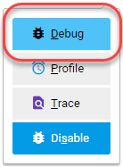

# 設定Xdebug

[!DNL Xdebug] 是用來偵錯PHP的擴充功能。 雖然您可以使用您選擇的IDE，但以下說明如何進行配置 [!DNL Xdebug] 和 [!DNL PhpStorm] 以在本機環境中除錯。

>[!NOTE]
>
>您可以設定 [!DNL Xdebug] 在Cloud Docker環境中執行本機偵錯，而不變更雲端基礎結構專案設定的Adobe Commerce。 另請參閱 [為Docker配置Xdebug](https://developer.adobe.com/commerce/cloud-tools/docker/test/configure-xdebug/).

若要啟用 [!DNL Xdebug]，您必須在Git存放庫中設定檔案、設定IDE並設定連線埠轉送。 您可以在中設定一些設定 `magento.app.yaml` 檔案。 編輯後，可在所有入門環境和Pro整合環境中推播Git變更，以啟用 [!DNL Xdebug]. [!DNL Xdebug] 已經在Pro測試和生產環境中提供。

設定之後，您就可以偵錯CLI命令、Web請求和程式碼。 請記住，所有雲端基礎結構環境都是唯讀的。 將程式碼複製到本機開發環境以執行偵錯。 如需Pro測試和生產環境相關資訊，請參閱 [其他指示](#debug-for-pro-staging-and-production) 的 [!DNL Xdebug].

## 需求

執行與使用 [!DNL Xdebug]，您需要環境的SSH URL。 您可以透過以下方式尋找資訊： [[!DNL Cloud Console]](../project/overview.md) 或您的 [!DNL Cloud Onboarding UI].

## 設定Xdebug

進行設定 [!DNL Xdebug]，請遵循下列步驟：

- [在分支中工作以推送檔案更新](#get-started-with-a-branch)
- [啟用 [!DNL Xdebug] 適用於環境](#enable-xdebug-in-your-environment)
- [設定IDE](#configure-phpstorm)
- [設定連線埠轉送](#set-up-port-forwarding)

### 開始使用分支

新增 [!DNL Xdebug]，Adobe建議使用 [開發分支](../dev-tools/cloud-cli-overview.md#create-an-environment-branch).

### 在您的環境中啟用Xdebug

您可以啟用 [!DNL Xdebug] 直接連線至所有入門環境和Pro整合環境。 Pro生產和中繼環境不需要此設定步驟。 另請參閱 [針對Pro測試和生產進行除錯](#debug-for-pro-staging-and-production).

若要啟用 [!DNL Xdebug] 針對您的專案，新增 `xdebug` 至 `runtime:extensions` 的區段 `.magento.app.yaml` 檔案。

**啟用Xdebug的方式**：

1. 在本機終端機中，開啟 `.magento.app.yaml` 文字編輯器中的檔案。

1. 在 `runtime` 區段，在 `extensions`，新增 `xdebug`. 例如：

   ```yaml
   runtime:
       extensions:
           - redis
           - xsl
           - newrelic
           - sodium
           - xdebug
   ```

1. 將變更儲存至 `.magento.app.yaml` 檔案並退出文字編輯器。

1. 新增、提交和推送變更以重新部署環境。

   ```bash
   git add -A
   ```

   ```bash
   git commit -m "Add xdebug"
   ```

   ```bash
   git push origin <environment-ID>
   ```

部署至入門環境和Pro整合環境時， [!DNL Xdebug] 現已推出。 繼續設定IDE。 若為PhpStorm，請參閱 [設定PhpStorm](#configure-phpstorm).

### 設定PhpStorm

此 [PhpStorm](https://www.jetbrains.com/phpstorm/) IDE必須設定為可正確搭配使用 [!DNL Xdebug].

**設定PhpStorm以搭配Xdebug使用**：

1. 在您的PhpStorm專案中，開啟 **設定** 面板。

   - _macOS_ — 選擇 **PhpStorm** > **偏好設定**.
   - _Windows/Linux_ — 選擇 **檔案** > **設定**.

1. 在 _設定_ 面板，展開並找到 **語言與架構** > **PHP** > **伺服器** 區段。

1. 按一下 **+** 以新增伺服器組態。 專案名稱在頂端為灰色。

1. [可選] 為新伺服器組態設定下列設定。 另請參閱 [未設定偵錯伺服器](https://www.jetbrains.com/help/phpstorm/troubleshooting-php-debugging.html#no-debug-server-is-configured) 在 _PHPStorm_ 檔案。

   - **名稱** — 輸入與主機名稱相同的。 此值必須與 `PHP_IDE_CONFIG` 中的變數 [偵錯CLI命令](#debug-cli-commands) 使用CLI進行偵錯。
   - **主機** — 輸入主機名稱。
   - **連線埠** — 輸入 `443`.
   - **Debugger** — 選擇 `Xdebug`.

1. 選取 **使用路徑對應**. 在 _檔案/目錄_ 窗格，的專案根目錄 `serverName` 顯示。

1. 在 **伺服器上的絕對路徑** 欄，按一下 **編輯** 圖示並根據環境新增設定。

   - 對於所有入門環境和Pro整合環境，遠端路徑為 `/app`.
   - 對於Pro測試和生產環境：

      - 生產： `/app/<project_code>/`
      - 分段：  `/app/<project_code>_stg/`

1. 變更 [!DNL Xdebug] 連線埠至9000，位於 **語言與架構** > **PHP** > **偵錯** > **Xdebug** > **偵錯連線埠** 面板。

1. 按一下 **套用**.

### 設定連線埠轉送

對應 `XDEBUG` 從伺服器到本機系統的連線。 若要執行任何型別的偵錯，您必須將連線埠9000從雲端基礎結構伺服器上的Adobe Commerce轉送至本機電腦。 請參閱下列其中一節：

- [Mac或UNIX上的連線埠轉送](#port-forwarding-on-mac-or-unix)
- [Windows上的連線埠轉送](#port-forwarding-on-windows)

#### Mac或UNIX上的連線埠轉送®

**在Mac或UNIX®環境中設定連線埠轉送**：

1. 開啟終端機。

1. 使用SSH建立連線。

   ```bash
   ssh -R 9000:localhost:9000 <ssh url>
   ```

   使用 `-v` （詳細）選項，以便每當通訊端連線到轉送的連線埠時，它就會顯示在終端機中。

   如果顯示「無法連線」或「無法接聽遠端連線埠」錯誤，則伺服器上可能持續存在另一個使用中的SSH工作階段，而此工作階段佔用連線埠9000。 如果該連線未使用，您可以終止它。

**疑難排解連線的方式**：

1. 使用SSH登入遠端整合、預備或生產環境。

1. 檢視SSH階段作業清單： `who`

1. 依使用者檢視現有的SSH工作階段。 請留意勿影響您以外的使用者！

   - 整合：使用者名稱類似於 `dd2q5ct7mhgus`
   - 分段：使用者名稱類似於 `dd2q5ct7mhgus_stg`
   - 生產：使用者名稱類似於 `dd2q5ct7mhgus`

1. 對於比您更早的使用者工作階段，請尋找虛擬終端機(PTS)值，例如 `pts/0`.

1. 終止與PTS值對應的處理序ID (PID)。

   ```bash
   ps aux | grep ssh
   kill <PID>
   ```

   範例回應：

   ```terminal
   dd2q5ct7mhgus        5504  0.0  0.0  82612  3664 ?      S    18:45   0:00 sshd: dd2q5ct7mhgus@pts/0
   ```

   若要終止連線，請輸入包含處理序ID (PID)的kill命令。

   ```bash
   kill 3664
   ```

#### Windows上的連線埠轉送

若要在Windows上設定連線埠轉送（SSH通道），您必須設定Windows終端機應用程式。 此範例會逐步說明如何使用建立SSH通道 [膩子](https://www.chiark.greenend.org.uk/~sgtatham/putty/latest.html). 您可以使用Cygwin等其他應用程式。 如需其他應用程式的詳細資訊，請參閱隨這些應用程式提供的廠商檔案。

**使用Putty在Windows上設定SSH通道**：

1. 如果您尚未這麼做，請下載 [膩子](https://www.chiark.greenend.org.uk/~sgtatham/putty/latest.html).

1. 啟動Putty。

1. 在類別窗格中，按一下 **工作階段**.

1. 輸入下列資訊：

   - **主機名稱（或IP位址）** 欄位：輸入 [SSH URL](../development/secure-connections.md#connect-to-a-remote-environment) 適用於您的雲端伺服器
   - **連線埠** 欄位：輸入 `22`

   

1. 在 _類別_ 窗格，按一下 **連線** > **SSH** > **隧道**.

1. 輸入下列資訊：

   - **來源連線埠** 欄位：輸入 `9000`
   - **目的地** 欄位：輸入 `127.0.0.1:9000`
   - 按一下 **遠端**

1. 按一下 **新增**.

   

1. 在 _類別_ 窗格，按一下 **工作階段**.

1. 在 **已儲存的工作階段** 欄位，輸入此SSH通道的名稱。

1. 按一下 **儲存**.

   

1. 若要測試SSH通道，請按一下 **載入**，然後按一下 **開啟**.

   如果顯示「無法連線」錯誤，請確認下列事項：

   - 所有Putty設定皆正確
   - 您正在雲端基礎結構上的私人Adobe Commerce SSH金鑰所在的電腦上執行Putty

## 透過SSH存取Xdebug環境

若要起始除錯、執行設定等作業，您需要SSH命令才能存取環境。 您可透過 [[!DNL Cloud Console]](../development/secure-connections.md#use-an-ssh-command) 以及您的專案試算表。

對於入門環境和Pro整合環境，您可以使用以下工具 `magento-cloud` 使用CLI命令透過SSH連線至這些環境：

```bash
magento-cloud environment:ssh --pipe -e <environment-ID>
```

使用 [!DNL Xdebug]， SSH連線至環境，如下所示：

```bash
ssh -R <xdebug listen port>:<host>:<xdebug listen port> <SSH-URL>
```

例如，

```bash
ssh -R 9000:localhost:9000 pwga8A0bhuk7o-mybranch@ssh.us.magentosite.cloud
```

## 針對Pro測試和生產進行除錯

>[!NOTE]
>
>在專業測試和生產環境中， [!DNL Xdebug] 隨時都可使用，因為這些環境有特殊的 [!DNL Xdebug]. 所有一般Web請求都會路由到沒有的專用PHP處理序 [!DNL Xdebug]. 因此，這些請求會正常處理，且在下列情況下不會導致效能降低 [!DNL Xdebug] 已載入。 當傳送的網路請求具有 [!DNL Xdebug] 鍵，它會繞線至具有下列專案的獨立PHP流程 [!DNL Xdebug] 已載入。

使用 [!DNL Xdebug] 特別是在Pro計畫測試和生產環境中，您可以建立單獨的SSH通道和Web工作階段，但只有您才有權存取。 此使用方法與一般存取不同，僅提供存取權給您，而非所有使用者。

您需要下列專案：

- 用於存取環境的SSH命令。 您可透過 [[!DNL Cloud Console]](../project/overview.md) 或您的 [!DNL Cloud Onboarding UI].
- 此 `xdebug_key` 設定Staging和Pro環境時設定的值。

  此 `xdebug_key` 可以透過使用SSH登入主要節點並執行以下動作來找到：

  ```bash
  cat /etc/platform/*/nginx.conf | grep xdebug.sock | head -n1
  ```

**若要設定至測試或生產環境的SSH通道**：

1. 開啟終端機。

1. 清除叢集之每個Web節點的所有SSH工作階段。

   ```bash
   ssh USERNAME@CLUSTER.ent.magento.cloud 'rm /run/platform/USERNAME/xdebug.sock'
   ```

1. 為叢集的每個Web節點設定Xdebug的SSH通道。

   ```bash
   ssh -R /run/platform/USERNAME/xdebug.sock:localhost:9000 -N USERNAME@CLUSTER.ent.magento.cloud
   ```

**使用環境URL開始偵錯**：

1. 啟用遠端偵錯；造訪瀏覽器中的網站，並將下列專案附加至URL，其中 `KEY` 為的值 `xdebug_key`.

   ```http
   ?XDEBUG_SESSION_START=KEY
   ```

   此步驟會設定傳送瀏覽器請求以觸發的Cookie [!DNL Xdebug].

1. 使用完成偵錯 [!DNL Xdebug].

1. 當您準備好結束工作階段時，請使用以下命令移除Cookie並透過瀏覽器結束除錯，其中 `KEY` 為的值 `xdebug_key`.

   ```http
   ?XDEBUG_SESSION_STOP=KEY
   ```

   >[!NOTE]
   >
   >此 `XDEBUG_SESSION_START` 傳遞者 `POST` 請求不受支援。

## 偵錯CLI命令

本節逐步解說如何偵錯CLI命令。

若要偵錯CLI命令：

1. 使用CLI命令以連線方式連線至您要偵錯的伺服器。

1. 建立下列環境變數：

   ```bash
   export XDEBUG_CONFIG='PHPSTORM'
   ```

   ```bash
   export PHP_IDE_CONFIG="serverName=<name of the server that is configured in PHPSTORM>"
   ```

   這些變數會在SSH工作階段結束時移除。

1. 開始偵錯

   在入門環境和Pro整合環境中，執行CLI命令以進行偵錯。
您可以新增執行階段選項，例如：

   ```bash
   php -d xdebug.profiler_enable=On -d xdebug.max_nesting_level=9999 bin/magento cache:clean
   ```

   在Pro測試和生產環境中，您必須指定 [!DNL Xdebug] 偵錯CLI命令時的PHP組態檔，例如：

   ```bash
   php -c /etc/platform/USERNAME/php.xdebug.ini bin/magento cache:clean
   ```

## 偵錯網頁請求

下列步驟可協助您偵錯Web請求。

1. 在 _副檔名_ 功能表，按一下 **偵錯** 以啟用。

1. 按一下滑鼠右鍵，選取選項選單，並將IDE鍵設定為 **PHPSTORM**.

1. 安裝 [!DNL Xdebug] 瀏覽器上的使用者端。 設定並啟用它。

### 範例：Chrome設定

本節將討論如何使用 [!DNL Xdebug] 在Chrome中使用 [!DNL Xdebug] 協助程式擴充功能。 如需的相關資訊 [!DNL Xdebug] 其他瀏覽器的工具，請參閱瀏覽器檔案。

**搭配Chrome使用Xdebug協助程式**：

1. 建立 [SSH通道](#ssh-access-to-xdebug-environments) 至雲端伺服器。

1. 安裝 [Xdebug Helper擴充功能](https://chromewebstore.google.com/detail/eadndfjplgieldjbigjakmdgkmoaaaoc) 從Chrome商店。

1. 在Chrome中啟用此擴充功能，如下圖所示。

   

1. 在Chrome中，以滑鼠右鍵按一下Chrome工具列上的綠色協助程式圖示。

1. 在快顯功能表中，按一下 **選項**.

1. 從 _IDE索引鍵_ 清單，按一下 **PhpStorm**.

1. 按一下 **儲存**.

   

1. 開啟您的PhpStorm專案。

1. 在頂端導覽列中，按一下 **開始接聽** 圖示。

   如果未顯示導覽列，請按一下 **檢視** > **導覽列**.

1. 在PhpStorm導覽窗格中，連按兩下PHP檔案以進行測試。

## 偵錯本機程式碼

由於是唯讀環境，您必須從環境或特定Git分支將程式碼提取至本機工作站，才能執行偵錯。

您選擇的方法由您決定。 您有以下選項：

- 從Git簽出程式碼並執行 `composer install`

  除非另有說明，否則此方法有效 `composer.json` 會參照您無權存取之私人存放庫中的套裝程式。 此方法可取得整個Adobe Commerce程式碼基底。

- 複製 `vendor`， `app`， `pub`， `lib`、和 `setup` 目錄

  此方法可讓您的程式碼完全可供測試。 視您擁有的靜態資產數量而定，可能會導致傳輸時間過長，並產生大量檔案。

- 複製 `vendor` 僅限目錄

  因為大部分的程式碼都位於 `vendor` 目錄，此方法可能會產生良好的測試，但不會測試整個程式碼基底。

**壓縮檔案並將它們複製到本機電腦**：

1. 使用SSH登入遠端環境。

1. 壓縮檔案。

   ```bash
   tar -czf /tmp/<file-name>.tgz <directory list>
   ```

   例如，若要壓縮 `vendor` 僅限目錄：

   ```bash
   tar -czf /tmp/vendor.tgz vendor
   ```

1. 在您的本機環境中，使用PhpStorm來壓縮檔案。

   ```bash
   cd <phpstorm project root dir>
   ```

   ```bash
   rsync <SSH-URL>:/tmp/<file-name>.tgz .
   ```

   ```bash
   tar xzf <file-name>.tgz
   ```
