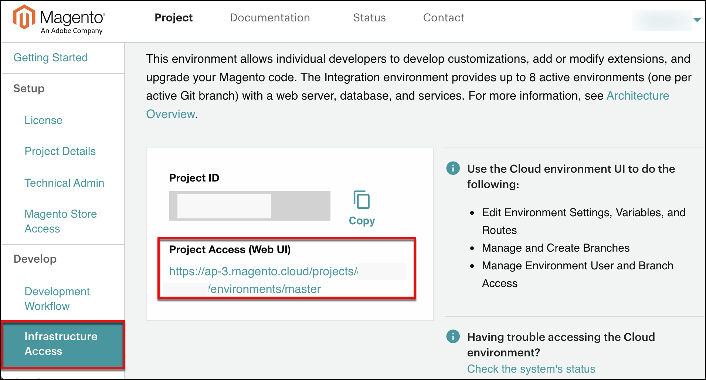

# [!DNL Onboarding] 至商務

Adobe在雲端基礎結構訂閱上啟用Commerce後，初始專案和程式碼存取權僅供指定為授權擁有者（帳戶擁有者）的人員使用。

授權擁有者是您企業或財務組織中負責雲端基礎結構帳戶上Adobe Commerce的付款和其他業務相關交易的人員。 此人可作為Adobe的聯絡點。 如果您必須變更您帳戶的授權擁有者，則必須聯絡您的Adobe帳戶團隊。

若要快速上線專案，以便開始開發網站進行即時部署，您必須完成所需的設定並 [!DNL onboarding] 任務。 通常，授權擁有者會透過保護管理員存取權並建立技術管理員使用者來開始此程式，這些使用者可協助進行設定、自訂和開發工作。

## 註冊雲端帳戶

如果您在雲端基礎結構帳戶上沒有Adobe Commerce，請聯絡 [銷售]. 當您註冊時，Adobe會建立您的帳戶，並傳送一封歡迎電子郵件給您，為您提供如何存取專案介面的指示。 電子郵件包含連結，讓您可登入帳戶並完成初始專案設定。

### 雲端 [!DNL Onboarding] UI

中的Adobe Commerce on cloud infrastructure專案頁面([!DNL Onboarding] UI)提供快速入門檢查清單，用於設定您的專案和服務、決定存取權，以及開始開發。 從OBUI，您可以：

- 新增技術管理員，此為可管理您的專案和分支的超級使用者
- 存取您的專案環境，包括連結 [!DNL Cloud Console]
- 完成快速使用者驗收測試(UAT)檢查清單，包含進一步測試的連結

**若要開啟專案頁面**：

1. 登入您的 [Adobe Commerce客戶帳戶](https://account.magento.com/customer/account/login).

1. 在 _我的帳戶_ 頁面，按一下 **[!UICONTROL Commerce]** 索引標籤以檢視您帳戶中的專案。

1. 按一下 **檢視專案頁面** 在 [專案區段](https://cloud.magento.com/cloud/project/).

1. 按一下專案名稱並開啟雲端專案頁面([!DNL Onboarding] UI)。

   

   瀏覽入口網站，取得有用的資訊和選項，以開始規劃您的專案、開發程式碼，以及準備UAT和網站啟動。

## 存取專案並新增使用者

授權所有者可以新增使用者帳戶，以提供對程式碼、管理分支、輸入票證和支援環境的存取權。 這些使用者帳戶可包含內部開發、顧問和解決方案專家。

通常，授權擁有者必須建立的唯一使用者是 _技術管理員_. 技術管理員需要具有管理員存取權的使用者帳戶才能為開發人員建立使用者帳戶、設定環境許可權，以及管理所有分支和環境。 技術管理員可以是開發人員、顧問、 [Adobe解決方案合作夥伴](https://business.adobe.com/products/magento/partners.html)，或您自己。

您可以透過專案入口網站，從以下網址建立技術管理員： [!DNL Cloud Console]，或從命令列使用 `magento-cloud` CLI

### 使用者註冊

您只能在雲端基礎結構專案和環境中將註冊使用者新增到您的Adobe Commerce。 如果您有新使用者，請要求他們 [註冊帳戶](https://account.magento.com/customer/account/login/) 以及提供與帳戶設定檔相關聯的電子郵件地址。

### 共用帳戶存取權

授權擁有者可以設定帳戶的共用存取權。 共用存取可讓信任的員工和服務供應商使用說明中心，提交和追蹤與雲端基礎結構專案中Adobe Commerce相關的支援票證。 如需設定指示，請參閱 [共用存取] 說明中心的文章。

### [!DNL Cloud Console]

您可以使用 [[!DNL Cloud Console]](cloud-console.md) 若要管理您的專案，請新增使用者帳戶，並開始開發您的存放區。 授權擁有者、技術管理員使用者和開發人員可以使用 [!DNL Cloud Console] 以管理所有環境和分支、環境變數、環境設定和路由。

**若要存取[!DNL Cloud Console]**：

1. 登入 [我的帳戶](https://account.magento.com/customer/account/login).

1. 在 _我的帳戶_ 頁面，按一下 **[!UICONTROL Commerce]** 索引標籤以檢視您帳戶中的專案。

1. 按一下 **專案** 標籤並選取專案。

1. 按一下 **基礎架構存取**，然後按一下 **專案存取(Web UI)**.

   

## 註冊Adobe狀態

從取得雲端基礎結構平台環境和相關服務上Adobe Commerce的更新 [狀態頁面].

此頁面提供Adobe Commerce元件和服務的狀態，隨後提供有關事件報告、服務升級、計畫中斷和已排程維護的通知。 在您的專案中工作的任何人都可以訂閱Adobe Commerce狀態網站，透過電子郵件或Slack接收事件通知和更新。 您可以自訂Adobe狀態訂閱，以依地區和事件追蹤特定產品。

>[!TIP]
>
> 開啟新的 [!DNL Cloud Console] 和檢視專案和環境活動。
>
>**下一步**： [登入Cl[！DNL ]oud Console](cloud-console.md)

<!-- link definitions -->

[銷售]: https://business.adobe.com/products/magento/get-demo.html
[共用存取]: https://experienceleague.adobe.com/docs/commerce-knowledge-base/kb/help-center-guide/magento-help-center-user-guide.html#shared-access
[狀態頁面]: https://status.adobe.com/products/503473
